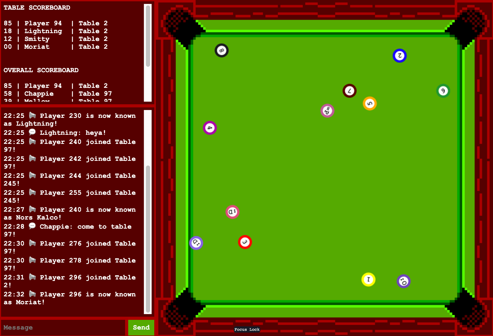

# YoYo Haku Pool - A game for JS13K 2022

YoYo Haku Pool puts you in control of a yoyo on a multiplayer pool table!

The goal is to keep the highest score as long as possible.

Click or touch the table to pull your yoyo.

Each ball has a value, and you should use yoyo maneuvers to bring them into the corner pockets.

If you push another yoyo into a corner pocket, you get part of their score, implying that you also lose part of your score if you end up in a corner pocket.

When the table is clean, balls are brought back to the table. Tip: Focus on pocketing the balls with high value first.

There are several tables in the room, and you can communicate with players from other tables through the chat area.

You can also run the following commands there:

> Command: /nick <nickname>  
> Effect: Changes your nickname.

> Command: /newtable  
> Effect: Starts a new game on an empty table.

> Command: /jointable <number>  
> Effect: Joins the game from a specific table.

> Command: /soundon  
> Effect: Enables sounds.

> Command: /soundoff  
> Effect: Disables sounds.

_The game follows the rules of [JS13K Server Category](https://github.com/js13kGames/js13kserver), which requires us to [host the server on Heroku](https://github.com/js13kGames/js13kserver#deploy-to-heroku)._

## Credits

- Pool Table from the [8 Ball Pool SMS Asset Pack by chasersgaming](https://chasersgaming.itch.io/asset-pack-8-ball-pool-sms)
- Several NPM Packages, which are listed on [package.json](./package.json)

## Tools used during development

- [Gitpod - Ready-to-code developer environments in the cloud](https://gitpod.io)
- [Piskel - Free online editor for animated sprites & pixel art](https://www.piskelapp.com)
- [Squoosh - Reduce file size from a image while maintain high quality](https://squoosh.app)
- [vConsole - Front-end developer tool for mobile web pages](https://github.com/Tencent/vConsole)
- [CSS Grid Layout generator](https://vue-grid-generator.netlify.app)
